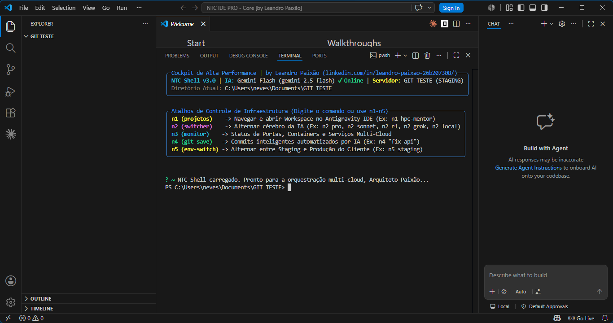

# 🪐 NTC Shell v3.0: O Cockpit DevOps Nativo com IA

[🇺🇸 Read in English](README.md)

Uma Interface de Terminal (TUI) avançada, agnóstica e nativa de Inteligência Artificial, projetada para otimizar a orquestração multi-cloud, troca de contexto e geração autônoma de código. Desenvolvida para Engenheiros DevOps de elite e Arquitetos SaaS que operam em ambientes internacionais de alto ritmo e com múltiplos clientes.

Desenvolvido por **Leandro Paixão** (SaaS & Cloud Architect).

---



## 🌌 A Filosofia: Por que IA no Terminal?

Configurações tradicionais de desenvolvimento tratam a IDE como o centro de gravidade. No entanto, para um Arquiteto SaaS, a IDE é apenas a oficina (focada em escrever texto). O Terminal é a plataforma de execução (focada em infraestrutura, dockerização, emuladores locais, sincronização de contexto e deploy).

Ao unir um motor de console de alta performance com telemetria local e uma variedade de APIs de LLMs de elite, o NTC Shell elimina a necessidade de trocar de contexto. Ele lida com diagnósticos de sistema offline (ultra-rápido, custo de $0) e delega tarefas cognitivas (debugging, arquitetura, escrita de código com agentes) para a nuvem apenas quando acionado.

```text
                     ┌─────────────────────────────────────────┐
                     │            COCKPIT DO LEANDRO           │
                     └────────────────────┬────────────────────┘
                                          │
                  ┌───────────────────────┴───────────────────────┐
                  ▼                                               ▼
         [ NTC IDE PRO ]                                   [ NTC SHELL ]
      Escrita & Edição Fina                          Orquestração & DevOps
    (Chat Lateral Estilo Cursor)                   (Motores de IA ?? e //)
```

---

## ⚡ Arquitetura Principal & Gateways Operacionais

O sistema segrega a consulta rápida em linguagem natural de modificações autônomas no sistema de arquivos usando um Gateway de IA Dual-Core distinto:

### 1. Gateway de Consultoria Cognitiva (`??`)
Um interpretador de linguagem natural de resposta instantânea. Ao passar argumentos sem aspas diretamente no terminal, o gateway empacota automaticamente variáveis de sistema, formata prompts brutos e consulta o LLM ativo através de um wrapper REST seguro e direto.

- **Sintaxe:** `?? <sua pergunta aqui em linguagem natural sem aspas>`
- **Resultado:** Um painel markdown totalmente renderizado mostrando a explicação arquitetural, comandos de sistema ou conceito.

### 2. Motor de Agente Autônomo (`//`)
Um wrapper a nível de produção em torno de motores de agentes de linha de comando de elite, integrado nativamente ao PowerShell. Ele inclui um prompt de transição inteligente que intercepta o comando para lançar seu workspace isolado **NTC IDE PRO**, garantindo máxima produtividade antes de executar ciclos agênticos completos (lê mapas de diretórios, diagnostica bugs, propõe atualizações de código).

- **Sintaxe:** `// "inspecione database.js e escreva um connection pool para lidar com falhas do Redis"`
- **Resultado:** Solicita a transição para o NTC IDE PRO, em seguida, engaja o agente autônomo para resolver a tarefa dentro do seu diretório de trabalho.

---

## 🎨 TUI Interativa de Alta Performance

O cockpit utiliza `Spectre.Console` sobre o PowerShell 7+ para renderizar um painel de controle de telemetria elegante e em tempo real:

- **Badge de Cérebro Ativo:** Exibe o LLM selecionado (Gemini Pro, Claude Sonnet, DeepSeek R1, Grok, Ollama Local, etc.) e adapta automaticamente os temas visuais de destaque com base na identidade de marca do provedor.
- **Sensor de Projeto Cloud Ativo:** Detecta automaticamente estados localizados de infraestrutura (ex: aliases ativos do Firebase, ambientes ativos do GCP, pilhas do Docker).
- **Guardrail de Deploy (Alertas Codificados por Cor):** Se o ambiente cloud ativo corresponder a `PRODUCTION` (Produção), o cabeçalho do cockpit pisca em **Vermelho Negrito**, atuando como um firewall psicológico para prevenir desastres acidentais de deploy. Se for `STAGING` (Testes), ele destaca em amarelo.

---

## 🛠️ A Matriz Operacional de 5 Passos (Atalhos Numéricos)

O NTC Shell mapeia fluxos de trabalho de elite para atalhos numéricos globais (`n1` a `n5`) para manter a velocidade com as mãos no teclado:

| Comando | Alias | Função | Escopo |
| :--- | :--- | :--- | :--- |
| `n1 [pasta]` | `workon` | **Teletransporte de Projeto.** Entra no diretório, carrega `.env`, lança o NTC IDE PRO. | Local |
| `n2 [modelo]` | `switch-model` | **Alternador de IA.** Alterna dinamicamente os cérebros cloud ativos (10 modos disponíveis). | Cloud API |
| `n3` | `sys-logs` / `monitor` | **Telemetria Local.** Verifica portas ativas, status de emuladores e saúde de containers. | Offline |
| `n4 [msg]` | `git-save` | **Controle de Versão.** Encapsula add, commit e push em um pipeline unificado e seguro. | DevOps |
| `n5 [env]` | `switch-env` | **Alternador de Env.** Alterna alvos cloud (Staging ↔ Production) e sincroniza contextos. | Infra Cloud |

---

## 🔒 Segurança & Guardrails Cloud

Ao trabalhar com clientes de elite em mercados internacionais, a segurança é inegociável. O NTC Shell embute guardrails locais diretamente no pipeline de entrega:

- **`env-check` (O Firewall Financeiro):** Integrado diretamente no `n4` (`git-save`). Antes de iniciar a entrega no Git, o script verifica se arquivos cloud sensíveis (ex: `.env`, `service-account.json`, chaves privadas secretas) estão expostos na área de staging. Se qualquer risco de segurança for detectado, o pipeline é bloqueado automaticamente, protegendo as contas de faturamento cloud dos clientes.
- **`git-undo`:** Uma válvula de segurança rápida para reverter instantaneamente os últimos commits do agente de IA, dando um soft-reset no HEAD sem apagar o progresso local.

---

## 🧠 Mapeamento de Cérebros (Matriz Multi-LLM)

O cockpit lida com trânsitos dinâmicos pelos principais provedores de IA, divididos por trabalho Rotineiro/Custo-Benefício e cargas de trabalho Pesadas/Raciocínio:

| Provedor | Modo de Rotina / Velocidade | Modo Pesado / Raciocínio |
| :--- | :--- | :--- |
| **Google Cloud** | Gemini x.x Flash | Gemini x.x Pro |
| **Anthropic** | Claude X.x Haiku | Claude x.x Sonnet |
| **DeepSeek** | DeepSeek Vx (Chat) | DeepSeek Rx (Reasoner) |
| **xAI** | Grok Build x.X | Grok X.x |
| **Local (Offline)** | Ollama (Llama 3 - Padrão) | Ollama (DeepSeek R1 Local) |

---

<br>
<div align="center">
  <em>“A melhor maneira de prever o futuro é construir as ferramentas que o orquestram.”</em>
</div>
